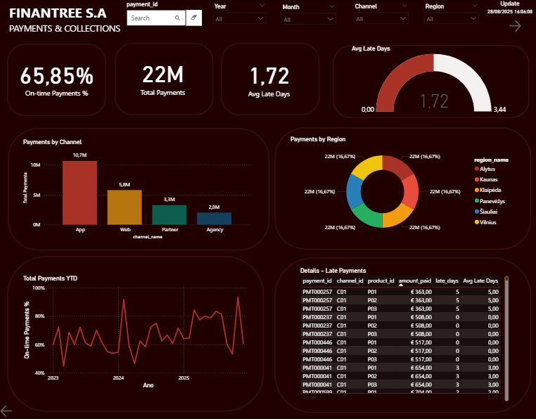
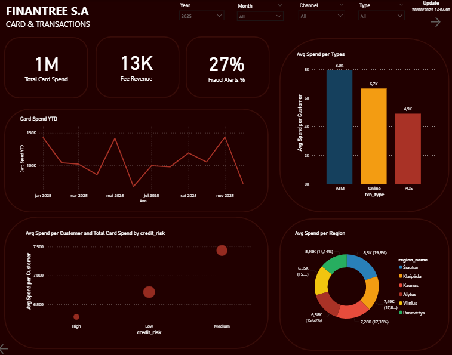

# FinanTree Euro – Business Intelligence Dashboard (Demo)

📊 **Overview**  
This project simulates a fintech company called **FinanTree S.A.**, focused on loans, cards, payments, and fraud monitoring.  
The goal is to demonstrate expertise in **Power BI, advanced DAX, and data modeling** applied to the financial services sector.

---

## 🚀 Features
- **Executive Overview**: Loan portfolio, active loans, default rate, fee revenue.  
- **Payments & Collections**: On-time payments, average late days, collections by region and channel.  
- **Cards & Transactions**: Card spend, transaction types (POS, ATM, Online), spend by region, ARPU.  
- **Fraud & Alerts**: Fraud alerts %, flagged amounts, alerts by region and channel.  

---

## 🛠️ Tech Stack
- **Power BI** (DAX, Power Query, tabular modeling)  
- **SQL** for synthetic fact/dimension table generation  
- **Excel/CSV** for demo datasets  

---

## 📂 Data Structure
- **Fact tables**: `fact_loans`, `fact_payments`, `fact_cards`, `fact_fraud_alerts`  
- **Dimension tables**: `dim_date`, `dim_customer`, `dim_product`, `dim_region`, `dim_channel`  
- **Measure tables**: `Measure_Cards_Fraud`, `Measure_Payments`, `Measure_Segments`, `Measure_Wallet_Credit`  

---

## 🔗 Model Relationships (keys)
- `fact_loans[customer_id]` → `dim_customer[customer_id]`  
- `fact_loans[date_key]` → `dim_date[date_key]`  
- `fact_loans[region_id]` → `dim_region[region_id]`  
- `fact_payments[channel_id]` → `dim_channel[channel_id]`  
- `fact_cards[date_key]` → `dim_date[date_key]`  
- `fact_fraud_alerts[customer_id]` → `dim_customer[customer_id]`  

---

## 📸 Preview
  
  

---

## 🎯 Key Learnings
- Built **fraud detection indicators** with DAX.  
- Modeled **loan portfolio & default rate** with time intelligence.  
- Applied **collections metrics** (on-time %, avg late days) for operational insights.  
- Designed with a **corporate fintech style** dashboard.  

---

## 📥 File
- [Download Dashboard PDF](./FinanTree-Euro-BI-Dashboard.pdf)

---

## 👨‍💻 Author
**Leonardo Cabral** – Data Analyst | Power BI | SQL | SAP | Power Platform  
Certification in progress: **Microsoft PL-300**
